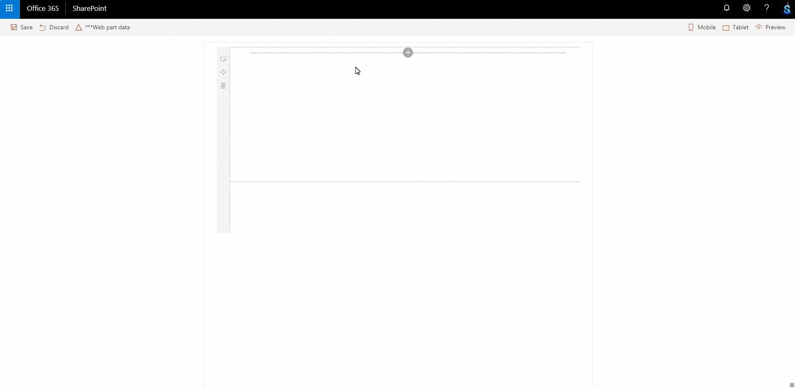

# Document List (React)

## Summary
SharePoint Framework webpart which will list all the folders and files from the configured 'Document Library'.

## Used SharePoint Framework Version 

## Applies to

* [SharePoint Framework](https:/dev.office.com/sharepoint)
* [Office 365 tenant](https://dev.office.com/sharepoint/docs/spfx/set-up-your-development-environment)

## Prerequisites
 
> @microsoft/generator-sharepoint - 1.4.1

## Solution

Solution|Author(s)
--------|---------
react-documentlist | Sudharsan K.([@sudharsank](https://twitter.com/sudharsank), [Know More](http://windowssharepointserver.blogspot.com/))

## Version history

Version|Date|Comments
-------|----|--------
1.0.0|June 13 2018|Initial release

## Disclaimer
**THIS CODE IS PROVIDED *AS IS* WITHOUT WARRANTY OF ANY KIND, EITHER EXPRESS OR IMPLIED, INCLUDING ANY IMPLIED WARRANTIES OF FITNESS FOR A PARTICULAR PURPOSE, MERCHANTABILITY, OR NON-INFRINGEMENT.**

## Minimal Path to Awesome

- Clone this repository
- in the command line run:
  - `npm install`
  - `gulp serve`

## Features
- Used [SharePoint Framework Property Controls](https://sharepoint.github.io/sp-dev-fx-property-controls/) to create the property pane controls(Text, Choice Group, Toggle) with callout.
- Used [SharePoint Framework React Controls](https://sharepoint.github.io/sp-dev-fx-controls-react) to create the configuration component for the web part.
- Used [Microsoft Office UI Fabric](https://developer.microsoft.com/en-us/fabric#/get-started) for the component design and design. Used fabric react controls like List, Document Card and Details List
- Used [PnP](https://pnp.github.io/pnpjs/getting-started.html) for communication with SharePoint.

#### Local Mode
This solution doesn't work on local mode.

#### SharePoint Mode
If you want to try on a real environment, open:
https://your-domain.sharepoint.com/_layouts/15/workbench.aspx